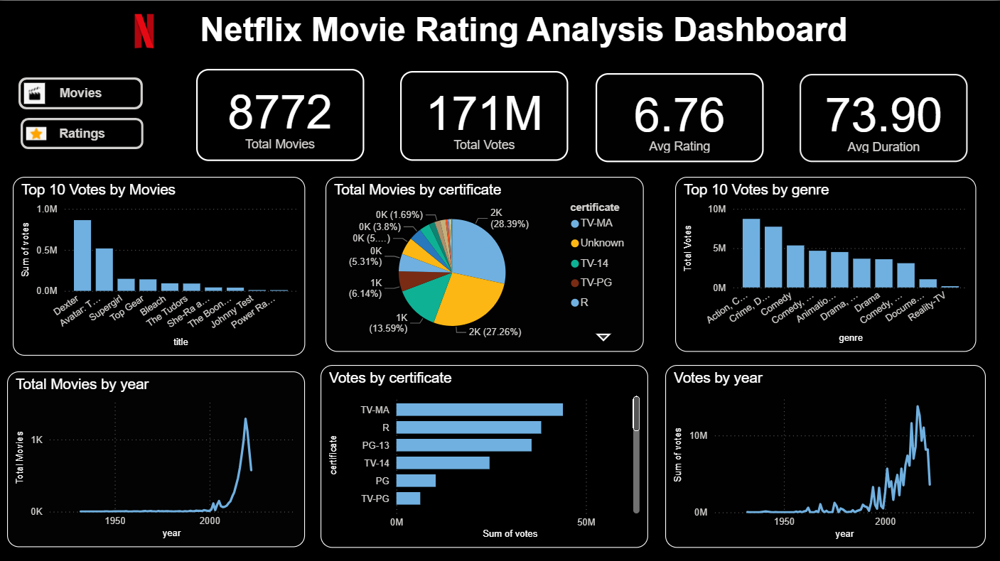
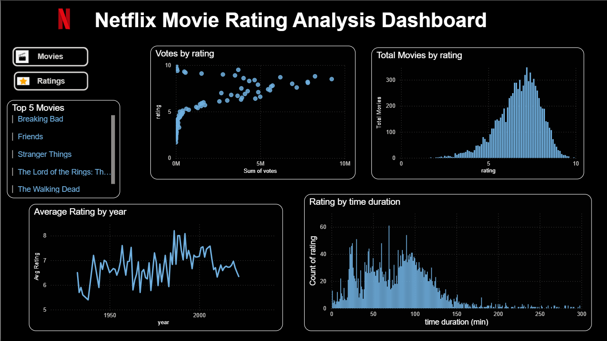

## 🎬 Netflix Movie Rating Analysis Dashboard

## 📌 Project Overview

This project analyzes Netflix movies and TV shows to uncover trends in ratings, votes, genres, certificates, duration, and release years. The analysis was performed using Python for data preprocessing and Power BI for creating an interactive dashboard.

The objective of this project is to transform raw movie data into meaningful insights that help understand audience preferences and content trends.

---

## 📊 Dashboard Pages

1️⃣ Movies Analysis Dashboard

Features:
 - Total Movies
 - Total Votes
 - Average Rating
 - Average Duration
 - Top 10 Movies by Votes
 - Movies by Certificate
 - Top Genres by Votes
 - Movies Released by Year
 - Votes by Certificate
 - Votes Trend by Year

2️⃣ Ratings Analysis Dashboard

Features:
 - Votes vs Rating Scatter Plot
 - Rating Distribution
 - Average Rating by Year
 - Rating vs Duration Analysis
 - Top Rated Movies List

---

## 🛠️ Tools & Technologies
 - Python
 - Pandas
 - NumPy
 - Power BI
 - Jupyter Notebook

---

## 🧹 Data Preparation

The dataset was cleaned and transformed using Python.

Data preprocessing steps included:
 - Handling missing values
 - Cleaning year column
 - Removing duplicates
 - Converting data types
 - Formatting vote counts
 - Processing duration values
 - Preparing data for visualization

---

## 📈 Key Insights
 - Content Growth : The number of movies and TV shows increased significantly after 2000.
 - Popular Genres : Action, Crime, Comedy, and Drama generate the highest audience engagement.
 - Ratings Distribution : Most titles are rated between 6 and 8 on IMDb.
 - Audience Engagement : Highly rated titles generally receive more votes, indicating stronger audience popularity.
 - Certificates : TV-MA and TV-14 certificates dominate the dataset.
 - Duration Trends : Most movies fall within the 80–120 minute duration range.

---

## 🎯 Project Objectives
 - Perform exploratory data analysis on movie data
 - Develop interactive Power BI dashboards
 - Identify rating and popularity trends
 - Improve data visualization skills
 - Build a portfolio-ready data analytics project

---

## 📸 Dashboard Preview

Movies Dashboard

Ratings Dashboard

